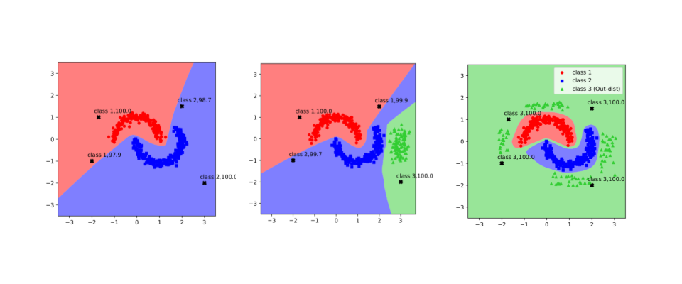

# Metrics to differntiate the Out-of-Distribution (OOD) sets
This repository contains the implementation of the metrics, namely **Softmax-based entropy (SE), Coverage Ratio (CR), Coverage Distance (CD)**, that are designed to measure the **protection level of in-distribution sub-manifolds in the feature space** by a given OOD set. The related paper is published in [ECAI 2020](http://ecai2020.eu/) and presented in [NeurIPS-Workshop on Safety and Robustness in Decision Making](https://sites.google.com/view/neurips19-safe-robust-workshop), 2019. This paper is also available at <https://arxiv.org/pdf/1910.08650.pdf>. 

## An illustrative explaination
The following figure illustrates intutively the idea of protection level. We differentiate the OOD sets with their level of protection. For example, the middle figure exhibits a partially-protective OOD set (shown by green triangles), while the right figure shows a protective OOD set. Their effect on
training an A-MLP (Augmented MLP) for a two-moon classification dataset can also be seen: the A-MLP trained on the protective OOD set leads to detection of all unseen OOD samples (black-cross samples) since all the regions out of the sub-manifolds of two-moon dataset are classified as class 3 (the extra class), while the partially-protective OOD set is not able to correctly detect all the unseen OOD samples. Note the vanilla MLP trained on the same dataset classifies the entire space into two classes regardless of the fact that some regions do not belong to the in-distribution sub-manifold.

## How to run the code
`python main_protection_level.py --config-file cifar10/exp_config`

`exp_config` contains all the configurations such as the filename of a pre-trained vanilla CNN, size of image, number of channel, and etc. For example, the filename of a pre-trained vanilla CNN can be specified as `pre_net=pretrained_model_filename` in `exp_config`. In `model_building.py`, there are VGG and ResNet architectures to be used, feel free to modify `model_building.py` to add your sepecific architecture. 

The script outputs a `.csv` file, in which each row has **SE, CR ,and CD** of an OOD set.

## Citation
`@article{abbasi2019toward,
title={Toward Metrics for Differentiating Out-of-Distribution Sets},
author={Abbasi, Mahdieh and Shui, Changjian and Rajabi, Arezoo and Gagne, Christian and Bobba, Rakesh},
journal={European Conference on Artificial Intelligence},
year={2020}}`

